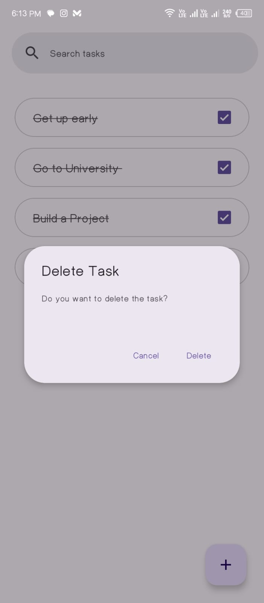
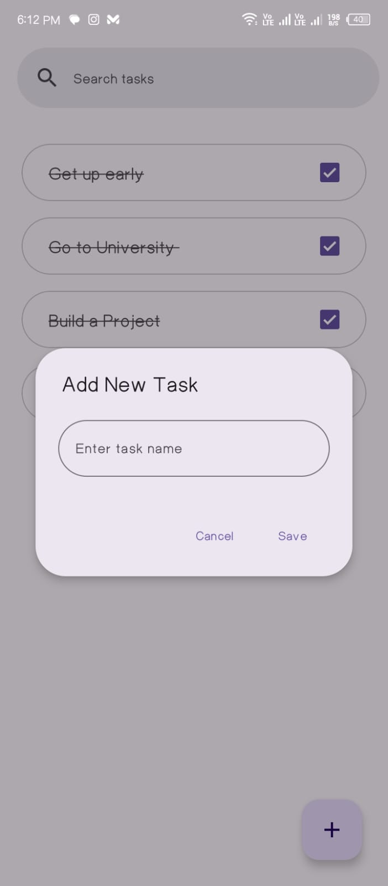
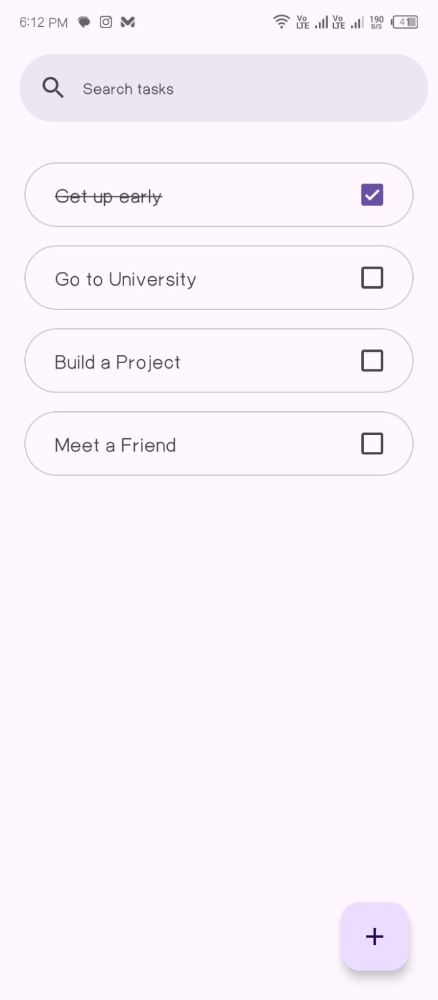

# To-Do List App

A simple and intuitive To-Do List app built with **Kotlin** using **Room Database**, **RecyclerView**, and **MVVM Architecture**. This app helps users manage their tasks efficiently by allowing them to add, edit, delete, and mark tasks as completed.

---

## Features

- Add new tasks with ease.
- Mark tasks as completed by checking a checkbox (supports strike-through for completed tasks).
- Long-press to delete tasks with a confirmation dialog.
- Persistent storage using Room Database.
- Modern UI designed with **XML layouts** following Material Design principles.

---

## Screenshots

<p align="center">
  
  
  
</p>


---

## Tech Stack

- **Language:** Kotlin
- **Architecture:** MVVM (Model-View-ViewModel)
- **Database:** Room
- **UI Design:** XML with Material Design components
- **RecyclerView:** For displaying the list of tasks

---

## Installation

1. Clone this repository:

   ```bash
   git clone https://github.com/yourusername/todo-list-app.git
   ```

2. Open the project in **Android Studio**.

3. Sync Gradle files to download dependencies.

4. Build and run the app on an emulator or physical device.

---

## How to Use

1. **Add a Task:**

   - Tap the floating action button (FAB) to add a new task.
   - Enter the task name and save.

2. **Complete a Task:**

   - Check the checkbox to mark a task as completed.
   - The task text will have a strike-through to indicate completion.

3. **Delete a Task:**

   - Long-press on a task to bring up a confirmation dialog.
   - Confirm deletion to remove the task.

---

## Code Highlights

### Room Database Entity

The `TaskEntity` class represents a task in the database:

```kotlin
@Entity(tableName = "tasks")
data class TaskEntity(
    @PrimaryKey(autoGenerate = true) val id: Int = 0,
    val taskName: String,
    val isChecked: Int = 0 // 1 for completed, 0 for not completed
)
```

### Task Adapter

The `TaskAdapter` handles the RecyclerView for displaying tasks:

```kotlin
class TaskAdapter(
    private var taskArrayList: List<TaskEntity>,
    private var isCheckBoxChanged: (TaskEntity) -> Unit,
    private var longClicked: (TaskEntity) -> Unit
) : RecyclerView.Adapter<TaskAdapter.TaskViewHolder>() {
    // Adapter implementation
}
```

### Material Dialog

The app uses Material Dialog for confirmation:

```kotlin
fun showDeleteTaskDialog(context: Context, onDeleteConfirmed: () -> Unit) {
    MaterialAlertDialogBuilder(context)
        .setTitle("Delete Task")
        .setMessage("Do you want to delete the task?")
        .setPositiveButton("Delete") { dialog, _ ->
            onDeleteConfirmed()
            dialog.dismiss()
        }
        .setNegativeButton("Cancel") { dialog, _ ->
            dialog.dismiss()
        }
        .show()
}
```

---

## Future Enhancements

- Add categories or tags for tasks.
- Implement a search functionality for tasks.
- Add due dates with notifications for reminders.
- Sync tasks to the cloud using Firebase.

---

## Contributing

Contributions are welcome! Feel free to fork this repository, submit issues, or make pull requests to improve the app.

---

## License

This project is licensed under the [MIT License](LICENSE).

---

## Acknowledgments

- [Material Design](https://material.io/design)
- [Android Room Documentation](https://developer.android.com/training/data-storage/room)

